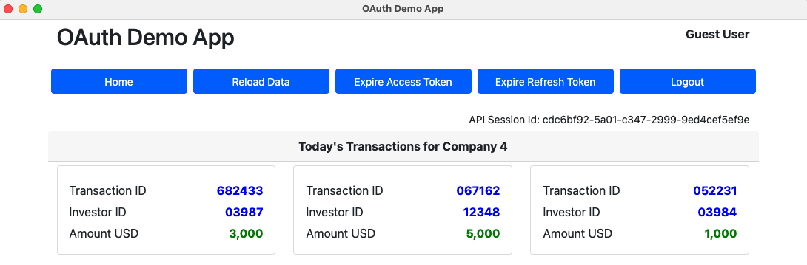
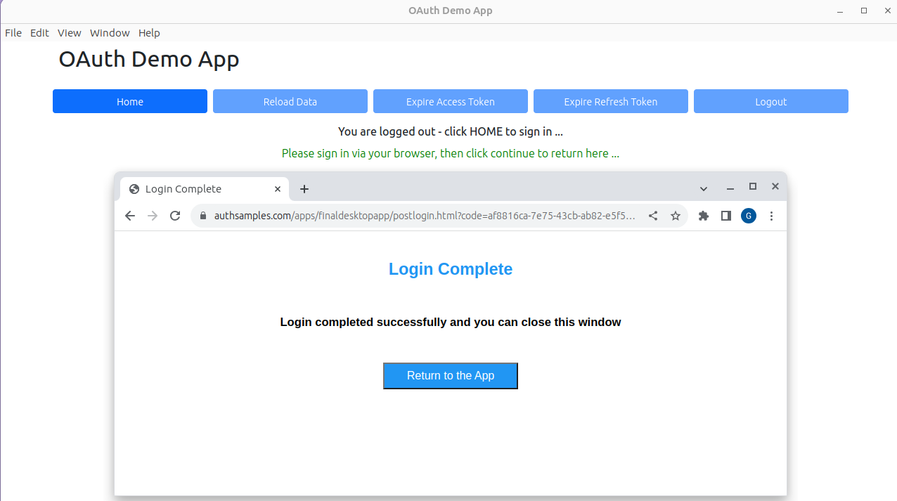

# Final OAuth Desktop App

[](https://www.codacy.com/gh/gary-archer/oauth.desktopsample.final/dashboard?utm_source=github.com&amp;utm_medium=referral&amp;utm_content=gary-archer/oauth.desktopsample.final&amp;utm_campaign=Badge_Grade)

[](https://snyk.io/test/github/gary-archer/oauth.desktopsample.final)

## Overview

* The final OpenID Connect desktop code sample, referenced in my blog at https://authguidance.com
* **The goal is to implement OpenID Connect desktop logins with best usability and reliability**

## Views

The desktop app is a simple UI with some basic navigation between views, to render fictional resources.\
The data is returned from an API that authorizes access to resources using domain specific claims.



## Local Development Quick Start

Build and run the app via this command, which will trigger the OpenID Connect desktop flow:

```bash
./start.sh
```

A login is triggered in the system browser, so that the app cannot access the user's credentials.\
A private URI scheme URL of `x-mycompany-desktopapp:/callback` is used to receive the login response:



You can login to the desktop app using my AWS Cognito test account:

```text
- User: guestuser@mycompany.com
- Password: GuestPassword1
```

You can then test all lifecycle operations, including token refresh, expiry events and logout.

## Further Information

Further architecture and non-functional details are described starting in the [Final Desktop Sample Overview](https://authguidance.com/2018/01/26/final-desktop-sample-overview/) blog post.


## Programming Languages

* Electron, TypeScript and React are used to implement the Cross Platform Desktop App

## Desktop Middleware Used

* The [AppAuth-JS Library](https://github.com/openid/AppAuth-JS/blob/master/README.md) is used to implement the Authorization Code Flow (PKCE)
* The [keytar](https://github.com/atom/node-keytar) library is used by the Desktop App for secure storage of OAuth tokens
* A Private URI Scheme is used by the system browser to return to the app after login

## Hosting

* AWS API Gateway is used to host the Desktop App's OAuth Secured API
* AWS Cognito is used as the default Authorization Server for the UI and API
