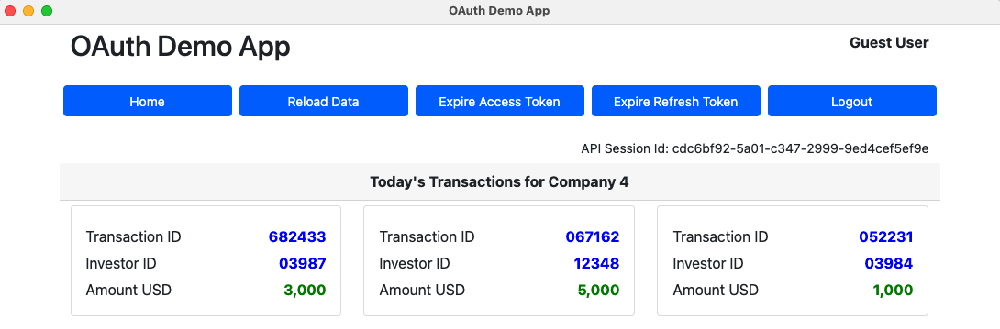
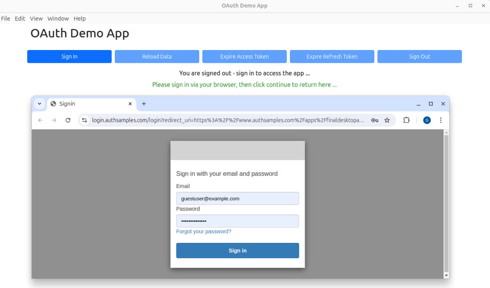

# Final OAuth Desktop App

[](https://app.codacy.com/gh/gary-archer/oauth.desktopsample.final?utm_source=github.com&utm_medium=referral&utm_content=gary-archer/oauth.desktopsample.final&utm_campaign=Badge_Grade)

[](https://snyk.io/test/github/gary-archer/oauth.desktopsample.final)

## Overview

A cross-platform demo desktop app using OpenID Connect, which aims for the best usability and reliability.

## Views

The app is a simple UI with some basic navigation between views, to render fictional investment resources.\
Its data is returned from an OAuth-secured API that uses claims-based authorization.\
The app uses user attributes from both the OpenID Connect userinfo endpoint and its API. 



## Local Development Quick Start

First ensure that Node.js 20+ is installed.\
Then build the app via this command, which compiles the renderer side of the app in watch mode:

```bash
./build.sh
```

Next run the app, to test the OpenID Connect desktop flow:

```bash
./run.sh
```

Run the app to trigger an OpenID Connect code flow to authenticate the user with the AppAuth pattern.\
The login runs in the default system browser and the app cannot access the user's credentials:



You can login to the desktop app using my AWS Cognito test account:

```text
- User: guestuser@example.com
- Password: GuestPassword1
```

The app receives the login response using a private URI scheme redirect URI.\
Interstitial web pages ensure a user gesture after login and logout, so that responses return to the app reliably.\
After login you can test all lifecycle operations, including token refresh, expiry events and logout.\
You can then package a platform-specific executable and test the release build behavior:

```bash
./pack.sh
```

## Further Information

* See the [API Journey - Client Side](https://apisandclients.com/posts/api-journey-client-side) for further information on the app's behaviour.
* See blog posts for further details specific to the app, starting in the [Final Desktop Sample Overview](https://apisandclients.com/posts/final-desktop-sample-overview).

## Programming Languages

* The app uses the Electron framework with TypeScript code and its views use React.

## Infrastructure

* The [AppAuth-JS](https://github.com/openid/AppAuth-JS/blob/master/README.md) library implements the code flow with PKCE.
* [AWS Serverless](https://github.com/gary-archer/oauth.apisample.serverless) or Kubernetes host remote API endpoints that the app calls.
* AWS Cognito is the default authorization server for the desktop app and API.
* Electron SafeStorage stores tokens securely, with encryption isolated from other apps and users.
